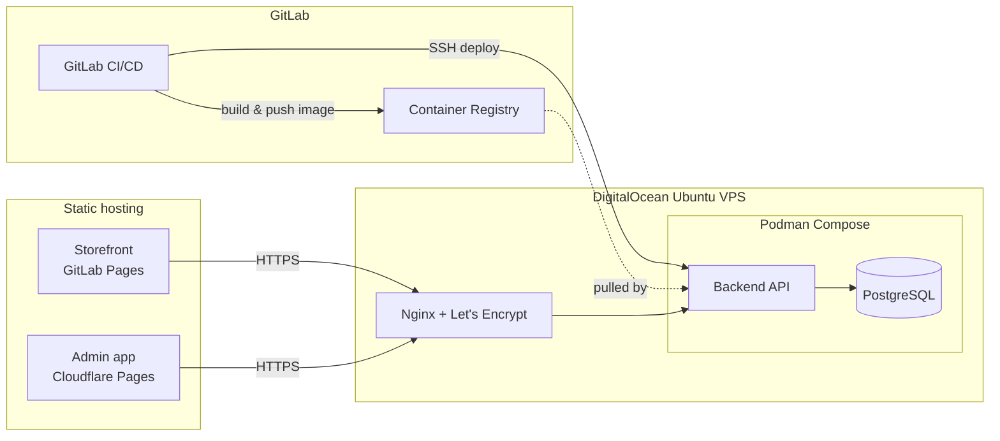

# Deploying Maps Kayz Fashions

Target architecture:



Backend and its Postgres database live on one VPS behind Nginx, built and
deployed automatically by GitLab CI/CD. Both frontends are static builds — the
customer storefront ships via GitLab Pages, the admin app via its own
Cloudflare Pages project (kept separate so it can sit behind its own access
controls and isn't crammed into the storefront's Pages deployment).

Everything below is config-as-code already committed in this repo
(`backend/deploy/`, `.gitlab-ci.yml`) — this doc is the runbook for the manual,
one-time setup steps (provisioning, DNS, secrets) that only a human with
DigitalOcean/GitLab/Cloudflare access can do.

## 0. Prerequisites

- A DigitalOcean account and a domain you control (e.g. `mapskayz.com`).
- This project pushed to a GitLab project, with the **Container Registry**
  enabled (Settings > Packages and registries > Container Registry).
- A Cloudflare account (free tier is fine) if you're using Cloudflare Pages
  for the admin app.

## 1. Create and secure the VPS

1. Create a droplet: Ubuntu 24.04 LTS, 1 GB RAM is enough for this workload
   (2 GB gives Postgres more headroom). Add your SSH key at creation time.
2. SSH in as root, then create a non-root deploy user and lock down SSH:
   ```sh
   adduser mapskayz-deploy
   usermod -aG sudo mapskayz-deploy
   rsync --archive --chown=mapskayz-deploy:mapskayz-deploy ~/.ssh /home/mapskayz-deploy
   ```
3. Firewall — only SSH, HTTP, HTTPS:
   ```sh
   ufw allow OpenSSH
   ufw allow 80/tcp
   ufw allow 443/tcp
   ufw enable
   ```
4. From here on, SSH in as `mapskayz-deploy`, not root.

## 2. Install Podman + Podman Compose

```sh
sudo apt update
sudo apt install -y podman
python3 -m pip install --user podman-compose
echo 'export PATH="$HOME/.local/bin:$PATH"' >> ~/.bashrc && source ~/.bashrc
podman --version && podman-compose --version
```

## 3. Install Nginx + Certbot

```sh
sudo apt install -y nginx certbot python3-certbot-nginx
```

Point DNS at the droplet first (an A record for `api.yourdomain.com` ->
the droplet's IP), then:

```sh
sudo cp backend/deploy/nginx/mapskayz-api.conf /etc/nginx/sites-available/mapskayz-api
# edit server_name in that file to your real api subdomain
sudo ln -s /etc/nginx/sites-available/mapskayz-api /etc/nginx/sites-enabled/
sudo nginx -t && sudo systemctl reload nginx
sudo certbot --nginx -d api.yourdomain.com
```

Certbot rewrites the site file in place to add the certificate paths and an
HTTP->HTTPS redirect, and installs a systemd timer that renews automatically
— confirm it with `sudo systemctl status certbot.timer`.

## 4. First deploy of the backend stack

```sh
sudo mkdir -p /opt/mapskayz
sudo chown mapskayz-deploy:mapskayz-deploy /opt/mapskayz
cp backend/deploy/compose.prod.yaml backend/deploy/deploy.sh /opt/mapskayz/
cp backend/deploy/.env.prod.example /opt/mapskayz/.env.prod
chmod +x /opt/mapskayz/deploy.sh
chmod 600 /opt/mapskayz/.env.prod
nano /opt/mapskayz/.env.prod   # fill in real values — see the comments in the file
```

Log in to the registry once by hand (a
[deploy token](https://docs.gitlab.com/user/project/deploy_tokens/) with
`read_registry` scope works well here, or a personal access token with
`read_registry`), then bring the stack up:

```sh
podman login registry.gitlab.com
cd /opt/mapskayz
CI_REGISTRY_IMAGE=registry.gitlab.com/your-namespace/your-project \
IMAGE_TAG=latest \
podman-compose -f compose.prod.yaml --env-file .env.prod up -d
curl http://127.0.0.1:9200/api/health
```

(If `compose.prod.yaml` can't pull the image yet because CI hasn't built one,
push to GitLab first so `build-backend` runs, then come back to this step.)

**Schema migrations**: local dev (sqlite) creates its schema automatically
via TypeORM's `synchronize: true`, which is deliberately *disabled* in
production — safe schema changes in a real database go through migrations
instead (`backend/src/database/migrations/`), which run automatically on
every container start when `NODE_ENV=production` (see `migrationsRun` in
`database.module.ts`). The included `InitialSchema` migration creates every
table; you won't need to run anything by hand for a first deploy. After
changing an entity later, generate the next migration against a real Postgres
and commit it:
```sh
DATABASE_URL=postgresql://mapskayz:<password>@localhost:5432/mapskayz \
  npm run migration:generate --prefix backend -- src/database/migrations/DescriveName
```
(point `DATABASE_URL` at a throwaway/local Postgres with the *previous*
schema already applied — not directly at production — then review the
generated SQL before committing it, same as reviewing any other diff).

## 5. Wire up GitLab CI/CD

1. Generate a dedicated deploy keypair (don't reuse your personal one):
   ```sh
   ssh-keygen -t ed25519 -C "gitlab-deploy" -f gitlab-deploy-key -N ""
   ```
2. On the VPS, add the **public** key to the deploy user:
   ```sh
   cat gitlab-deploy-key.pub >> ~/.ssh/authorized_keys
   ```
3. In GitLab: Settings > CI/CD > Variables, add:
   | Key | Value | Flags |
   |---|---|---|
   | `SSH_PRIVATE_KEY` | contents of `gitlab-deploy-key` (the private half) | Protected, Masked, File-type off |
   | `DEPLOY_HOST` | droplet IP or hostname | Protected |
   | `DEPLOY_USER` | `mapskayz-deploy` | Protected |

   `CI_REGISTRY`, `CI_REGISTRY_USER`, `CI_REGISTRY_PASSWORD`, and
   `CI_REGISTRY_IMAGE` are already provided by GitLab automatically.
4. Mark your default branch (`main`) as **Protected** (Settings > Repository >
   Protected branches) so those Protected variables are available to its
   pipeline.
5. Push to `main`. `build-backend` builds and pushes the image;
   `deploy-backend` then SSHes in and runs `/opt/mapskayz/deploy.sh`, which
   pulls that image and restarts the stack.

## 6. Deploy the storefront (GitLab Pages)

1. In GitLab: Settings > CI/CD > Variables, add `VITE_API_BASE_URL` =
   `https://api.yourdomain.com` (used by the `pages` job in `.gitlab-ci.yml`).
2. Push to `main` — the `pages` job builds `frontend/` and publishes it.
3. Settings > Pages > New Domain to attach `mapskayz.com` (or `www.`), and
   follow GitLab's instructions for the DNS record + verification.

## 7. Deploy the admin app (Cloudflare Pages)

1. Cloudflare dashboard > Workers & Pages > Create > Pages > connect your
   GitLab repo.
2. Build settings:
   - **Root directory**: `frontend-admin`
   - **Build command**: `npm run build`
   - **Build output directory**: `dist`
   - **Environment variable**: `VITE_API_BASE_URL` = `https://api.yourdomain.com`
3. Custom domain: add `admin.mapskayz.com` in the Pages project's Custom
   domains tab — Cloudflare manages the DNS + TLS for it automatically if
   your domain's nameservers are already on Cloudflare.
4. (Recommended) Put this project behind
   [Cloudflare Access](https://developers.cloudflare.com/cloudflare-one/policies/access/)
   so the admin panel isn't reachable by anyone who just guesses the URL —
   it's a second layer in front of the app's own staff login, not a
   replacement for it.

Either app can go on Cloudflare Pages instead of GitLab Pages with the same
build settings pattern (root directory `frontend`, output `dist`) if you'd
rather keep both in one place — just drop the `pages` job from
`.gitlab-ci.yml` if you do.

## Day-to-day operations

- **Logs**: `podman logs -f mapskayz_api_1` (add `mapskayz_db_1` for Postgres).
- **Rollback**: re-run the deploy with an older tag —
  `ssh mapskayz-deploy@host "IMAGE_TAG=<previous-short-sha> CI_REGISTRY_IMAGE=... /opt/mapskayz/deploy.sh"`.
  Every commit's image is kept in the registry tagged by its short SHA.
- **Database backup**: `podman exec mapskayz_db_1 pg_dump -U mapskayz mapskayz | gzip > backup-$(date +%F).sql.gz`
  — schedule this with cron; nothing here does it automatically.
- **Cert renewal**: automatic via `certbot.timer`; `sudo certbot renew --dry-run`
  to sanity-check it.
- **Migrating to managed Postgres later**: point `DATABASE_URL` in
  `.env.prod` at the managed instance and stop starting the `db` service
  (`podman-compose -f compose.prod.yaml --env-file .env.prod up -d api`) —
  see the comments in `backend/deploy/.env.prod.example`.

## Troubleshooting

- **502 from Nginx**: the `api` container isn't up or isn't healthy yet —
  check `podman ps` and `podman logs mapskayz_api_1`.
- **CORS errors in the browser console**: `CORS_ORIGINS` in `.env.prod` must
  exactly match the frontend's origin(s), including scheme (`https://`), no
  trailing slash.
- **SSE (live sync) not updating in the admin app**: confirm Nginx picked up
  the `/api/sync/events` block in `mapskayz-api.conf` — `curl -N https://api.yourdomain.com/api/sync/events`
  should hang open and print a heartbeat every ~20s, not disconnect.
- **CI deploy job fails to connect**: `ssh-keyscan` output must match what's
  in the job log; if the droplet was rebuilt its host key changed and the
  `known_hosts` step will need the new one (it's fetched fresh every run, so
  this is usually just a stale `DEPLOY_HOST` value).
