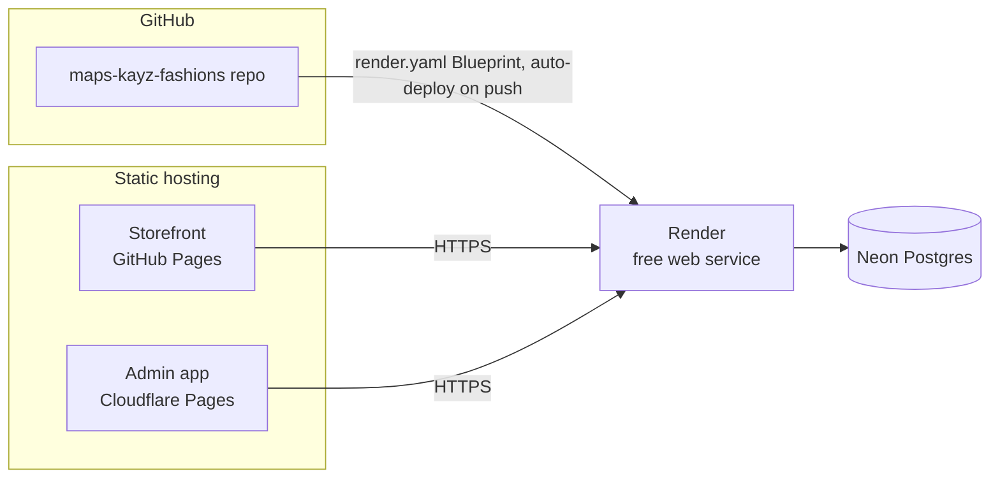

# Deploying Maps Kayz Fashions

**Live backend**: `https://maps-kayz-backend.onrender.com`

Target architecture (current — see the appendices for the Cloud Run and
DigitalOcean VPS alternatives this can switch to later, once real traffic
makes paying for either worth avoiding their free tiers' limits):



The backend is a Docker container deployed to Render's free web service tier
— no card required, TLS handled automatically, builds and redeploys on every
push to `master` with zero CI wiring (Render watches the GitHub repo
directly). It talks to a Neon Postgres database over the internet with TLS.
Both frontends are static builds — the customer storefront ships via GitHub
Pages, the admin app via its own Cloudflare Pages project (kept separate so
it can sit behind its own access controls and isn't crammed into the
storefront's Pages deployment).

Everything below is config-as-code already committed in this repo
(`render.yaml`) — this doc is the runbook for the manual, one-time setup
steps (accounts, connecting the repo, environment variables) that only a
human with Render/Neon/GitHub/Cloudflare access can do.

## 0. Prerequisites

- A [Render](https://render.com) account (free, no card) — already set up
  and connected to GitHub.
- A [Neon](https://neon.tech) account (free, no card) — already set up; the
  `maps-kayz-fashions` project exists with a `production` branch.
- This project pushed to GitHub (already done —
  `github.com/Tynashe271/maps-kayz-fashions`).
- A Cloudflare account (free tier is fine) for the admin app — not set up yet.

## 1. The Neon database (already done)

`maps-kayz-fashions` project, `production` branch, `neondb` database. To
find the connection string again later: Neon console > this project >
Connect > copy the pooled connection string (the `-pooler` hostname —
already what's configured, better suited to a web service's many short-lived
connections than the direct/unpooled one). It already includes
`?sslmode=require`, which is why `DATABASE_SSL=true` is set in `render.yaml`
— `backend/src/database/data-source.ts` / `database.module.ts` won't
negotiate TLS correctly with Neon without it.

Schema: no manual setup was needed — `backend/src/database/migrations/`
ran automatically against it on the backend's first boot (see
`migrationsRun` in `database.module.ts`), confirmed live (a real
`POST /api/auth/register` round-tripped through it).

## 2. The Render backend (already done)

Render dashboard > New > Blueprint > connected to `Tynashe271/maps-kayz-fashions`
(branch `master`) > it read `render.yaml` and created **maps-kayz-backend**
as a free Docker web service. The `sync: false` entries in `render.yaml`
(`DATABASE_URL`, `JWT_SECRET`) were filled in during that setup; the rest
(`CORS_ORIGINS`, `WHATSAPP_ORDER_NUMBER`, `PAYMENT_WEBHOOK_SECRET`,
`WHATSAPP_WEBHOOK_SECRET`) were left blank on purpose — see step 5.

To change any of these later: this service's page > **Environment** tab >
edit a value > it redeploys automatically. To see build/runtime output:
this service's page > **Logs** tab.

**Every push to `master` that touches `backend/**` or `render.yaml`
auto-deploys** — no GitHub Actions, no secrets to keep in sync in two
places. Push, then watch the **Deploys** tab.

**Schema migrations** (for later, when an entity changes): local dev
(sqlite) creates its schema automatically via TypeORM's `synchronize: true`,
which is deliberately *disabled* in production — safe schema changes in a
real database go through migrations instead, generated against a throwaway
Postgres with the *previous* schema already applied (not directly against
Neon's production branch):
```sh
DATABASE_URL=postgresql://mapskayz:<password>@localhost:5432/mapskayz \
  npm run migration:generate --prefix backend -- src/database/migrations/DescriptiveName
```
review the generated SQL before committing it, same as reviewing any other
diff — then push, and Render's next deploy runs it automatically.

**Cold starts**: the free instance spins down after 15 minutes idle; the
first request after that takes 30-60s to wake back up. Fine for now — see
the Cloud Run/VPS appendices once real traffic makes that worth paying to
avoid (Render's own paid tiers remove it too, for that matter).

## 3. Deploy the storefront (GitHub Pages)

1. Settings > Pages > Build and deployment > Source: **GitHub Actions**
   (one-time toggle — without this the already-committed `deploy-pages.yml`
   workflow has nothing to deploy to).
2. Settings > Secrets and variables > Actions > **Variables** tab (not
   Secrets — this one isn't sensitive) > New repository variable:
   `VITE_API_BASE_URL` = `https://maps-kayz-backend.onrender.com`.
3. Push to `master` with changes under `frontend/` (or Actions tab >
   "Deploy storefront to GitHub Pages" > Run workflow) — it builds and
   publishes via Pages.
4. Note the Pages URL (Settings > Pages shows it, or add a custom domain
   there) and come back to step 5 to add it to `CORS_ORIGINS`.

## 4. Deploy the admin app (Cloudflare Pages)

1. Cloudflare dashboard > Workers & Pages > Create > Pages > connect the
   same GitHub repo.
2. Build settings:
   - **Root directory**: `frontend-admin`
   - **Build command**: `npm run build`
   - **Build output directory**: `dist`
   - **Environment variable**: `VITE_API_BASE_URL` = `https://maps-kayz-backend.onrender.com`
3. Note the `*.pages.dev` URL it gives you (or add a custom domain in the
   project's Custom domains tab).
4. (Recommended) Put this project behind
   [Cloudflare Access](https://developers.cloudflare.com/cloudflare-one/policies/access/)
   so the admin panel isn't reachable by anyone who just guesses the URL —
   it's a second layer in front of the app's own staff login, not a
   replacement for it.

## 5. Close the loop: lock down CORS

Now that both frontend URLs exist, go to the Render service's **Environment**
tab and set `CORS_ORIGINS` to both, comma-separated, e.g.:
```
https://tynashe271.github.io,https://maps-kayz-admin.pages.dev
```
Saving it triggers an automatic redeploy — no extra step needed.

## Day-to-day operations

- **Logs**: Render dashboard > `maps-kayz-backend` > Logs tab (live-tails).
- **Rollback**: Render dashboard > `maps-kayz-backend` > Deploys tab > find
  an earlier successful deploy > "Redeploy".
- **Database backup**: Neon keeps point-in-time restore on the free tier for
  a rolling window (check retention under Neon > this project > Settings) —
  for a longer-term copy, `pg_dump "$DATABASE_URL" | gzip > backup-$(date +%F).sql.gz`
  from anywhere with the connection string.
- **Waking a cold instance before it matters** (e.g. before a demo): just
  hit `https://maps-kayz-backend.onrender.com/api/health` a minute early.

## Troubleshooting

- **CORS errors in the browser console**: `CORS_ORIGINS` (Render >
  Environment) must exactly match the frontend's origin(s), including
  scheme (`https://`), no trailing slash — see step 5.
- **`DATABASE_URL is required when NODE_ENV=production`**: the env var is
  empty in Render's Environment tab — re-check it wasn't accidentally
  cleared.
- **Postgres connection refused / self-signed certificate error**: confirm
  `DATABASE_SSL=true` is still set (it's in `render.yaml` by default) —
  without it, `pg` won't negotiate TLS the way Neon expects.
- **A request right after idle time is very slow**: that's the free tier's
  cold start (see above), not a bug — if it's timing out entirely rather
  than just being slow, check the Logs tab for a crash on boot instead.
- **SSE (live sync) not updating in the admin app**: Render supports
  long-lived connections fine, but confirm nothing between the browser and
  Render (a corporate proxy, an ad blocker) is buffering it — `curl -N
  https://maps-kayz-backend.onrender.com/api/sync/events` should hang open
  and print a heartbeat every ~20s, not disconnect.

## Appendix A: switching to Google Cloud Run later

`.github/workflows/deploy-backend-cloudrun.yml` is committed and
manual-trigger only (Google Cloud requires a payment method on file to
enable Cloud Run at all, even for free-tier usage, which is why this is
parked rather than active). To switch to it:

1. Paste into [Cloud Shell](https://console.cloud.google.com) (no local
   `gcloud` install needed) or a local install:
   ```sh
   gcloud projects create maps-kayz-fashions --name="Maps Kayz Fashions"
   gcloud config set project maps-kayz-fashions
   gcloud billing accounts list
   gcloud billing projects link maps-kayz-fashions --billing-account=YOUR_BILLING_ACCOUNT_ID
   gcloud services enable run.googleapis.com artifactregistry.googleapis.com iam.googleapis.com
   gcloud artifacts repositories create maps-kayz --repository-format=docker --location=europe-west1
   gcloud iam service-accounts create github-actions-deploy --display-name="GitHub Actions Deploy"
   PROJECT_ID=$(gcloud config get-value project)
   SA="github-actions-deploy@$PROJECT_ID.iam.gserviceaccount.com"
   gcloud projects add-iam-policy-binding $PROJECT_ID --member="serviceAccount:$SA" --role="roles/run.admin"
   gcloud projects add-iam-policy-binding $PROJECT_ID --member="serviceAccount:$SA" --role="roles/artifactregistry.writer"
   gcloud projects add-iam-policy-binding $PROJECT_ID --member="serviceAccount:$SA" --role="roles/iam.serviceAccountUser"
   gcloud iam service-accounts keys create github-actions-key.json --iam-account=$SA
   cat github-actions-key.json   # copy this into the GCP_SA_KEY secret below, then delete the local file
   ```
2. GitHub repo Settings > Secrets and variables > Actions > add
   `GCP_PROJECT_ID`, `GCP_SA_KEY` (the key JSON), `DATABASE_URL` (reuse the
   same Neon connection string, or a different Neon branch), `JWT_SECRET`,
   `CORS_ORIGINS`, `WHATSAPP_ORDER_NUMBER`, `PAYMENT_WEBHOOK_SECRET`,
   `WHATSAPP_WEBHOOK_SECRET`.
3. Edit `deploy-backend-cloudrun.yml`'s trigger back to `push` (same
   `paths:` pattern the other workflows use), and disable the Render service
   (or just leave it running as a spare — free tier costs nothing idle) so
   only one is the source of truth for `VITE_API_BASE_URL` / `CORS_ORIGINS`.

## Appendix B: switching to a self-hosted DigitalOcean VPS later

`.github/workflows/deploy-backend-vps.yml` is committed and manual-trigger
only (DigitalOcean also requires a payment method on file), alongside
`backend/deploy/{compose.prod.yaml,deploy.sh,nginx/mapskayz-api.conf,.env.prod.example}`.
To switch to it:

1. Create a droplet (Ubuntu 24.04 LTS) once DigitalOcean billing is set up,
   `adduser mapskayz-deploy`, lock down SSH, `ufw allow` 22/80/443 — see the
   comments in `backend/deploy/nginx/mapskayz-api.conf` and
   `backend/deploy/compose.prod.yaml` for the full picture.
2. Install Podman + `podman-compose`, Nginx, and Certbot on it; copy
   `backend/deploy/{compose.prod.yaml,deploy.sh,.env.prod.example}` to
   `/opt/mapskayz/` and fill in `.env.prod` (it already supports either the
   bundled `db` Postgres service or an external one like Neon — see the
   comments in `.env.prod.example`).
3. Point `api.yourdomain.com` at the droplet, `certbot --nginx -d
   api.yourdomain.com`.
4. Add `SSH_PRIVATE_KEY` / `DEPLOY_HOST` / `DEPLOY_USER` repo secrets, edit
   `deploy-backend-vps.yml`'s trigger back to `push`, and disable the Render
   service so it isn't also deploying on every push.
