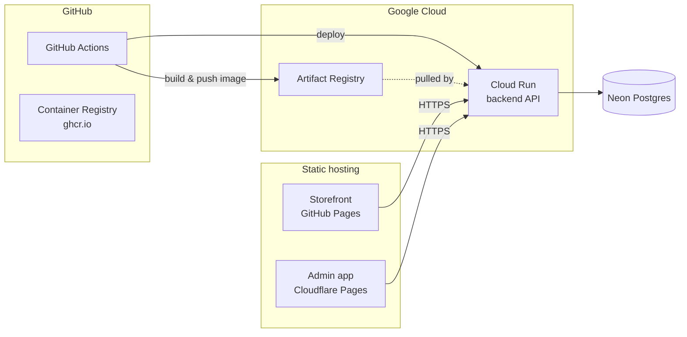

# Deploying Maps Kayz Fashions

Target architecture (current — see the appendix for the DigitalOcean VPS
alternative this can switch to later):



The backend is a container deployed to Cloud Run (fully managed — no server
to patch, TLS handled automatically, scales to zero when idle), talking to a
Neon Postgres database over the internet with TLS. Both frontends are static
builds — the customer storefront ships via GitHub Pages, the admin app via
its own Cloudflare Pages project (kept separate so it can sit behind its own
access controls and isn't crammed into the storefront's Pages deployment).

Everything below is config-as-code already committed in this repo
(`.github/workflows/deploy-backend-cloudrun.yml`) — this doc is the runbook
for the manual, one-time setup steps (accounts, billing, secrets) that only
a human with GitHub/Google Cloud/Neon/Cloudflare access can do. None of this
needs `gcloud` installed locally — the commands below are meant to be pasted
into [Cloud Shell](https://console.cloud.google.com) (a free terminal built
into the Cloud Console, already authenticated as you) or your own machine if
you'd rather install the SDK.

## 0. Prerequisites

- A Google Cloud account with a payment method on file (Cloud Run's free
  tier — 2 million requests/month — covers a low-traffic store at $0, but
  Google still requires billing enabled on the project to turn Cloud Run on
  at all).
- A [Neon](https://neon.tech) account (free tier, no card required).
- This project pushed to a GitHub repository (already done —
  `github.com/Tynashe271/maps-kayz-fashions`).
- A Cloudflare account (free tier is fine) for the admin app.

## 1. Create the Neon database

1. [console.neon.tech](https://console.neon.tech) > New Project > name it
   `maps-kayz` (region doesn't need to match GCP's — Cloud Run isn't
   latency-sensitive to this for an admin/storefront API).
2. Copy the connection string it gives you (Dashboard > Connection Details).
   It already includes `?sslmode=require` — that's expected, it's how the
   `DATABASE_SSL=true` setting below is meant to be used.
3. That's it — no schema setup needed. `backend/src/database/migrations/`
   runs automatically against it on the backend's first boot (see
   `migrationsRun` in `database.module.ts`).

## 2. Set up the Google Cloud project

Paste into [Cloud Shell](https://console.cloud.google.com) (click the `>_`
icon top-right of the console) or a local `gcloud` install:

```sh
# 1. Create and select a project (id must be globally unique — adjust if taken)
gcloud projects create maps-kayz-fashions --name="Maps Kayz Fashions"
gcloud config set project maps-kayz-fashions

# 2. Link billing — list your billing accounts, then link the one you want
gcloud billing accounts list
gcloud billing projects link maps-kayz-fashions --billing-account=YOUR_BILLING_ACCOUNT_ID

# 3. Enable the APIs this deploy needs
gcloud services enable run.googleapis.com artifactregistry.googleapis.com iam.googleapis.com

# 4. Create the Artifact Registry repo the workflow pushes images to
gcloud artifacts repositories create maps-kayz --repository-format=docker --location=europe-west1

# 5. Create a service account for GitHub Actions to deploy as
gcloud iam service-accounts create github-actions-deploy --display-name="GitHub Actions Deploy"

# 6. Grant it exactly what it needs: push images, deploy Cloud Run, and act as the runtime service account
PROJECT_ID=$(gcloud config get-value project)
SA="github-actions-deploy@$PROJECT_ID.iam.gserviceaccount.com"
gcloud projects add-iam-policy-binding $PROJECT_ID --member="serviceAccount:$SA" --role="roles/run.admin"
gcloud projects add-iam-policy-binding $PROJECT_ID --member="serviceAccount:$SA" --role="roles/artifactregistry.writer"
gcloud projects add-iam-policy-binding $PROJECT_ID --member="serviceAccount:$SA" --role="roles/iam.serviceAccountUser"

# 7. Create a key for it and print it (copy this straight into the GitHub secret below)
gcloud iam service-accounts keys create github-actions-key.json --iam-account=$SA
cat github-actions-key.json
```

(`europe-west1` is just a reasonable default close to Zimbabwe/Southern
Africa via undersea cable routing — change it in both this command and
`GCP_REGION` in `.github/workflows/deploy-backend-cloudrun.yml` if you'd
rather use a different region; keep the two in sync.)

Once you've copied the key JSON into the GitHub secret in the next section,
delete the local file — it's a standing credential:
```sh
rm github-actions-key.json
```

## 3. Wire up GitHub Actions secrets

In the GitHub repo: Settings > Secrets and variables > Actions > New
repository secret, add:

| Name | Value |
|---|---|
| `GCP_PROJECT_ID` | the project id from step 2 (e.g. `maps-kayz-fashions`), not its display name |
| `GCP_SA_KEY` | the full JSON key contents from step 2 |
| `DATABASE_URL` | the Neon connection string from step 1 |
| `JWT_SECRET` | a long random string (e.g. `openssl rand -base64 32`) |
| `CORS_ORIGINS` | leave empty for now — see step 5 |
| `WHATSAPP_ORDER_NUMBER` | international digits only, e.g. `263781657310` |
| `PAYMENT_WEBHOOK_SECRET` | leave empty until a real payment provider is wired up |
| `WHATSAPP_WEBHOOK_SECRET` | leave empty until the WhatsApp Business Platform is wired up |

## 4. First deploy

Push to `master` with a change under `backend/` (or trigger it manually:
Actions tab > "Deploy backend (Cloud Run)" > Run workflow). Watch it in the
Actions tab — the last step prints the live service URL, something like
`https://maps-kayz-backend-xxxxxxxxxx-ew.a.run.app`. Confirm it's actually
up:
```sh
curl https://maps-kayz-backend-xxxxxxxxxx-ew.a.run.app/api/health
```

**Schema migrations**: local dev (sqlite) creates its schema automatically
via TypeORM's `synchronize: true`, which is deliberately *disabled* in
production — safe schema changes in a real database go through migrations
instead (`backend/src/database/migrations/`), which run automatically on
every container start when `NODE_ENV=production`. The included
`InitialSchema` migration creates every table; you won't need to run
anything by hand for a first deploy. After changing an entity later,
generate the next migration against a throwaway Postgres with the *previous*
schema already applied (not directly against Neon's production branch) and
commit it:
```sh
DATABASE_URL=postgresql://mapskayz:<password>@localhost:5432/mapskayz \
  npm run migration:generate --prefix backend -- src/database/migrations/DescriptiveName
```
review the generated SQL before committing it, same as reviewing any other diff.

## 5. Deploy the storefront (GitHub Pages)

1. Settings > Pages > Build and deployment > Source: **GitHub Actions**
   (one-time toggle — without this the `deploy-pages.yml` workflow has
   nothing to deploy to).
2. Settings > Secrets and variables > Actions > **Variables** tab (not
   Secrets — this one isn't sensitive) > New repository variable:
   `VITE_API_BASE_URL` = the Cloud Run URL from step 4.
3. Push to `master` with changes under `frontend/` (or re-run the workflow
   manually) — it builds and publishes via Pages.
4. Note the Pages URL (Settings > Pages shows it, or add a custom domain
   there) and come back to step 7 to add it to `CORS_ORIGINS`.

## 6. Deploy the admin app (Cloudflare Pages)

1. Cloudflare dashboard > Workers & Pages > Create > Pages > connect your
   GitHub repo.
2. Build settings:
   - **Root directory**: `frontend-admin`
   - **Build command**: `npm run build`
   - **Build output directory**: `dist`
   - **Environment variable**: `VITE_API_BASE_URL` = the Cloud Run URL from step 4
3. Note the `*.pages.dev` URL it gives you (or add a custom domain in the
   project's Custom domains tab).
4. (Recommended) Put this project behind
   [Cloudflare Access](https://developers.cloudflare.com/cloudflare-one/policies/access/)
   so the admin panel isn't reachable by anyone who just guesses the URL —
   it's a second layer in front of the app's own staff login, not a
   replacement for it.

## 7. Close the loop: lock down CORS

Now that both frontend URLs exist, go back and set the `CORS_ORIGINS` GitHub
secret to both of them, comma-separated, e.g.:
```
https://tynashe271.github.io,https://maps-kayz-admin.pages.dev
```
Then re-run the Cloud Run workflow (Actions tab > Run workflow) to pick it
up — Cloud Run only applies new env vars on a new deploy.

## Day-to-day operations

- **Logs**: Cloud Console > Cloud Run > `maps-kayz-backend` > Logs, or
  `gcloud run services logs read maps-kayz-backend --region europe-west1`.
- **Rollback**: Cloud Run keeps every past revision — Cloud Console > Cloud
  Run > `maps-kayz-backend` > Revisions > select an older one > Manage
  Traffic > send 100% to it. (Or re-run the workflow from an older commit.)
- **Database backup**: Neon keeps point-in-time restore on the free tier for
  a rolling window (check your plan's retention in the Neon dashboard) —
  for a longer-term copy, `pg_dump "$DATABASE_URL" | gzip > backup-$(date +%F).sql.gz`
  from anywhere with the connection string.
- **Scaling / cold starts**: Cloud Run scales to zero by default, so the
  first request after idle time is slower (a few seconds). Set a minimum
  instance count (`gcloud run services update maps-kayz-backend --min-instances=1`)
  once real traffic makes that cold-start delay worth paying for — it moves
  the service off the free tier's "scale to zero" cost model.

## Troubleshooting

- **CORS errors in the browser console**: `CORS_ORIGINS` must exactly match
  the frontend's origin(s), including scheme (`https://`), no trailing
  slash — see step 7.
- **`DATABASE_URL is required when NODE_ENV=production`**: the `DATABASE_URL`
  secret is empty or missing — check it's actually set in the repo's Actions
  secrets, not just in your local `.env`.
- **Postgres connection refused / self-signed certificate error**: confirm
  `DATABASE_SSL=true` is present in the workflow's `env_vars` (it is, by
  default, in `deploy-backend-cloudrun.yml`) — without it, `pg` won't
  negotiate TLS the way Neon expects.
- **Deploy step fails with a permissions error**: the `github-actions-deploy`
  service account is probably missing one of the three IAM roles from step
  2.6 — re-run those `gcloud projects add-iam-policy-binding` commands.
- **SSE (live sync) not updating in the admin app**: Cloud Run supports
  long-lived connections fine, but confirm nothing between the browser and
  Cloud Run (a corporate proxy, an ad blocker) is buffering it — `curl -N
  <your-cloud-run-url>/api/sync/events` should hang open and print a
  heartbeat every ~20s, not disconnect.

## Appendix: switching to a self-hosted DigitalOcean VPS later

The original Podman + Nginx + Let's Encrypt + PostgreSQL-on-VPS design is
still here, just dormant — `.github/workflows/deploy-backend-vps.yml` is
manual-trigger only so it doesn't fail on every push while there's no
droplet. To switch to it:

1. Create a droplet (Ubuntu 24.04 LTS) once DigitalOcean billing is set up,
   `adduser mapskayz-deploy`, lock down SSH, `ufw allow` 22/80/443 — see the
   comments in `backend/deploy/nginx/mapskayz-api.conf` and
   `backend/deploy/compose.prod.yaml` for the full picture.
2. Install Podman + `podman-compose`, Nginx, and Certbot on it; copy
   `backend/deploy/{compose.prod.yaml,deploy.sh,.env.prod.example}` to
   `/opt/mapskayz/` and fill in `.env.prod` (it already supports either the
   bundled `db` Postgres service or an external one like Neon — see the
   comments in `.env.prod.example`).
3. Point `api.yourdomain.com` at the droplet, `certbot --nginx -d
   api.yourdomain.com`.
4. Add `SSH_PRIVATE_KEY` / `DEPLOY_HOST` / `DEPLOY_USER` repo secrets, edit
   `deploy-backend-vps.yml`'s trigger back to `push` (same `paths:` pattern
   as the Cloud Run workflow), and disable/delete the Cloud Run workflow so
   they don't both deploy on every push.
