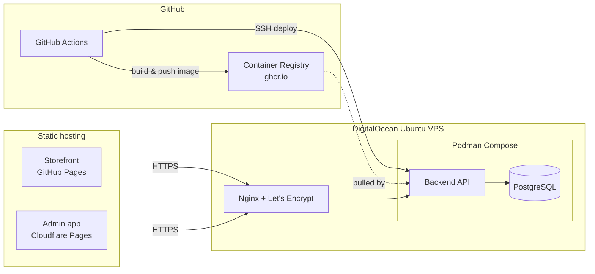

# Deploying Maps Kayz Fashions

Target architecture:



Backend and its Postgres database live on one VPS behind Nginx, built and
deployed automatically by GitHub Actions. Both frontends are static builds —
the customer storefront ships via GitHub Pages, the admin app via its own
Cloudflare Pages project (kept separate so it can sit behind its own access
controls and isn't crammed into the storefront's Pages deployment).

Everything below is config-as-code already committed in this repo
(`backend/deploy/`, `.github/workflows/`) — this doc is the runbook for the
manual, one-time setup steps (provisioning, DNS, secrets) that only a human
with DigitalOcean/GitHub/Cloudflare access can do.

## 0. Prerequisites

- A DigitalOcean account (with a payment method on file) and a domain you
  control (e.g. `mapskayz.com`).
- This project pushed to a GitHub repository (public or private — GitHub
  Container Registry and GitHub Pages both work on private repos on the free
  plan).
- A Cloudflare account (free tier is fine) if you're using Cloudflare Pages
  for the admin app.

## 1. Create and secure the VPS

1. Create a droplet: Ubuntu 24.04 LTS, 1 GB RAM is enough for this workload
   (2 GB gives Postgres more headroom). Add your SSH key at creation time.
2. SSH in as root, then create a non-root deploy user and lock down SSH:
   ```sh
   adduser mapskayz-deploy
   usermod -aG sudo mapskayz-deploy
   rsync --archive --chown=mapskayz-deploy:mapskayz-deploy ~/.ssh /home/mapskayz-deploy
   ```
3. Firewall — only SSH, HTTP, HTTPS:
   ```sh
   ufw allow OpenSSH
   ufw allow 80/tcp
   ufw allow 443/tcp
   ufw enable
   ```
4. From here on, SSH in as `mapskayz-deploy`, not root.

## 2. Install Podman + Podman Compose

```sh
sudo apt update
sudo apt install -y podman
python3 -m pip install --user podman-compose
echo 'export PATH="$HOME/.local/bin:$PATH"' >> ~/.bashrc && source ~/.bashrc
podman --version && podman-compose --version
```

## 3. Install Nginx + Certbot

```sh
sudo apt install -y nginx certbot python3-certbot-nginx
```

Point DNS at the droplet first (an A record for `api.yourdomain.com` ->
the droplet's IP), then:

```sh
sudo cp backend/deploy/nginx/mapskayz-api.conf /etc/nginx/sites-available/mapskayz-api
# edit server_name in that file to your real api subdomain
sudo ln -s /etc/nginx/sites-available/mapskayz-api /etc/nginx/sites-enabled/
sudo nginx -t && sudo systemctl reload nginx
sudo certbot --nginx -d api.yourdomain.com
```

Certbot rewrites the site file in place to add the certificate paths and an
HTTP->HTTPS redirect, and installs a systemd timer that renews automatically
— confirm it with `sudo systemctl status certbot.timer`.

## 4. First deploy of the backend stack

```sh
sudo mkdir -p /opt/mapskayz
sudo chown mapskayz-deploy:mapskayz-deploy /opt/mapskayz
cp backend/deploy/compose.prod.yaml backend/deploy/deploy.sh /opt/mapskayz/
cp backend/deploy/.env.prod.example /opt/mapskayz/.env.prod
chmod +x /opt/mapskayz/deploy.sh
chmod 600 /opt/mapskayz/.env.prod
nano /opt/mapskayz/.env.prod   # fill in real values — see the comments in the file
```

Log in to the registry once by hand — a
[classic Personal Access Token](https://github.com/settings/tokens) with the
`read:packages` scope works for this (a fine-grained token scoped to just
this repo's "Contents: read" + package access also works, but the package
permission model for fine-grained tokens is newer/less predictable — classic
is the safe default here) — then bring the stack up:

```sh
podman login ghcr.io -u your-github-username
cd /opt/mapskayz
REGISTRY_IMAGE=ghcr.io/your-github-username/your-repo/backend \
IMAGE_TAG=latest \
podman-compose -f compose.prod.yaml --env-file .env.prod up -d
curl http://127.0.0.1:9200/api/health
```

(If `compose.prod.yaml` can't pull the image yet because CI hasn't built one,
push to GitHub first so the `build` job in `deploy-backend.yml` runs, then
come back to this step. Also make sure the package's visibility allows your
account to pull it — a package inherits the repo's visibility by default, so
a private repo means a private package, which your own login can always
pull.)

**Schema migrations**: local dev (sqlite) creates its schema automatically
via TypeORM's `synchronize: true`, which is deliberately *disabled* in
production — safe schema changes in a real database go through migrations
instead (`backend/src/database/migrations/`), which run automatically on
every container start when `NODE_ENV=production` (see `migrationsRun` in
`database.module.ts`). The included `InitialSchema` migration creates every
table; you won't need to run anything by hand for a first deploy. After
changing an entity later, generate the next migration against a real Postgres
and commit it:
```sh
DATABASE_URL=postgresql://mapskayz:<password>@localhost:5432/mapskayz \
  npm run migration:generate --prefix backend -- src/database/migrations/DescriveName
```
(point `DATABASE_URL` at a throwaway/local Postgres with the *previous*
schema already applied — not directly at production — then review the
generated SQL before committing it, same as reviewing any other diff).

## 5. Wire up GitHub Actions

1. Generate a dedicated deploy keypair (don't reuse your personal one):
   ```sh
   ssh-keygen -t ed25519 -C "github-actions-deploy" -f github-deploy-key -N ""
   ```
2. On the VPS, add the **public** key to the deploy user:
   ```sh
   cat github-deploy-key.pub >> ~/.ssh/authorized_keys
   ```
3. In the GitHub repo: Settings > Secrets and variables > Actions > New
   repository secret, add:
   | Name | Value |
   |---|---|
   | `SSH_PRIVATE_KEY` | contents of `github-deploy-key` (the private half) |
   | `DEPLOY_HOST` | droplet IP or hostname |
   | `DEPLOY_USER` | `mapskayz-deploy` |

   `GITHUB_TOKEN` is provided automatically by Actions for each run — no
   setup needed for registry auth.
4. Push to `master` with changes under `backend/`. The `build` job in
   `deploy-backend.yml` builds and pushes the image to `ghcr.io`; `deploy`
   then SSHes in and runs `/opt/mapskayz/deploy.sh`, which pulls that image
   and restarts the stack.
5. First time only: the pushed package may default to **private** visibility
   linked to the repo, which is fine (the VPS logs in with a real account),
   but confirm under the repo's "Packages" tab (right sidebar) that the
   `backend` package exists and is linked to this repository.

## 6. Deploy the storefront (GitHub Pages)

1. Settings > Pages > Build and deployment > Source: **GitHub Actions**
   (one-time toggle — without this the `deploy-pages.yml` workflow has
   nothing to deploy to).
2. (Optional) Settings > Secrets and variables > Actions > Variables tab
   (not Secrets — this one isn't sensitive) > New repository variable:
   `VITE_API_BASE_URL` = `https://api.yourdomain.com`.
3. Push to `master` with changes under `frontend/` — the workflow builds it
   and publishes via Pages.
4. Settings > Pages > Custom domain to attach `mapskayz.com` (or `www.`),
   and follow GitHub's instructions for the DNS record + verification.

## 7. Deploy the admin app (Cloudflare Pages)

1. Cloudflare dashboard > Workers & Pages > Create > Pages > connect your
   GitHub repo (authorize the Cloudflare GitHub App for it if this is the
   first project you're linking).
2. Build settings:
   - **Root directory**: `frontend-admin`
   - **Build command**: `npm run build`
   - **Build output directory**: `dist`
   - **Environment variable**: `VITE_API_BASE_URL` = `https://api.yourdomain.com`
3. Custom domain: add `admin.mapskayz.com` in the Pages project's Custom
   domains tab — Cloudflare manages the DNS + TLS for it automatically if
   your domain's nameservers are already on Cloudflare.
4. (Recommended) Put this project behind
   [Cloudflare Access](https://developers.cloudflare.com/cloudflare-one/policies/access/)
   so the admin panel isn't reachable by anyone who just guesses the URL —
   it's a second layer in front of the app's own staff login, not a
   replacement for it.

Either app can go on Cloudflare Pages instead of GitHub Pages with the same
build settings pattern (root directory `frontend`, output `dist`) if you'd
rather keep both in one place — just drop `.github/workflows/deploy-pages.yml`
if you do.

## Day-to-day operations

- **Logs**: `podman logs -f mapskayz_api_1` (add `mapskayz_db_1` for Postgres).
- **Rollback**: re-run the deploy with an older tag —
  `ssh mapskayz-deploy@host "IMAGE_TAG=<previous-commit-sha> REGISTRY_IMAGE=ghcr.io/... /opt/mapskayz/deploy.sh"`.
  Every commit's image is kept in the registry tagged by its full commit SHA.
- **Database backup**: `podman exec mapskayz_db_1 pg_dump -U mapskayz mapskayz | gzip > backup-$(date +%F).sql.gz`
  — schedule this with cron; nothing here does it automatically.
- **Cert renewal**: automatic via `certbot.timer`; `sudo certbot renew --dry-run`
  to sanity-check it.
- **Migrating to managed Postgres later**: point `DATABASE_URL` in
  `.env.prod` at the managed instance and stop starting the `db` service
  (`podman-compose -f compose.prod.yaml --env-file .env.prod up -d api`) —
  see the comments in `backend/deploy/.env.prod.example`.

## Troubleshooting

- **502 from Nginx**: the `api` container isn't up or isn't healthy yet —
  check `podman ps` and `podman logs mapskayz_api_1`.
- **CORS errors in the browser console**: `CORS_ORIGINS` in `.env.prod` must
  exactly match the frontend's origin(s), including scheme (`https://`), no
  trailing slash.
- **SSE (live sync) not updating in the admin app**: confirm Nginx picked up
  the `/api/sync/events` block in `mapskayz-api.conf` — `curl -N https://api.yourdomain.com/api/sync/events`
  should hang open and print a heartbeat every ~20s, not disconnect.
- **Deploy job fails to connect over SSH**: `ssh-keyscan` output must match
  what's in the job log; if the droplet was rebuilt its host key changed and
  the `known_hosts` step will need the new one (it's fetched fresh every run,
  so this is usually just a stale `DEPLOY_HOST` secret).
- **`denied: permission_denied` on `podman login ghcr.io`**: the token needs
  `read:packages` (VPS pulling) or `write:packages` (pushing by hand) — a
  fine-grained token needs its "Packages" permission set explicitly, which
  is easy to miss.
